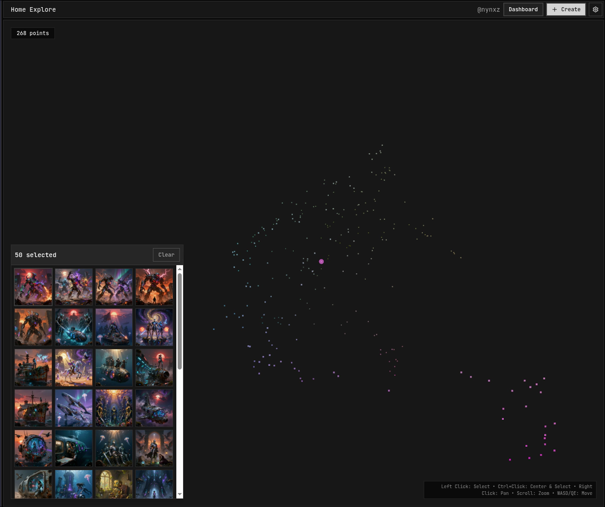
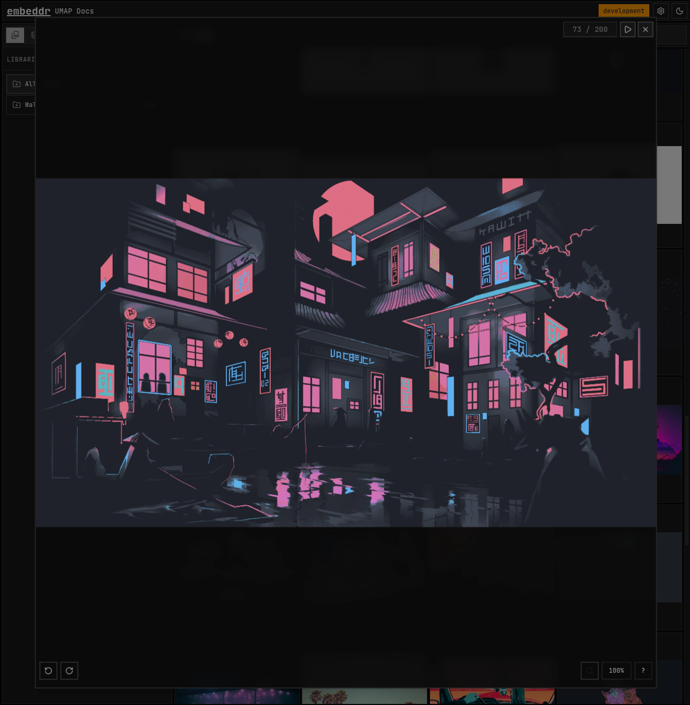
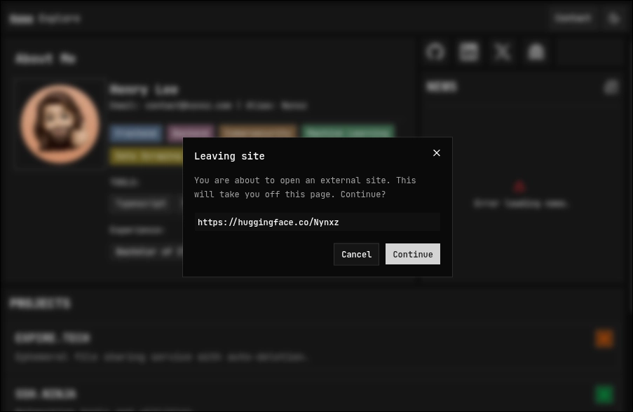

<h1>Embeddr React Components</h1>

[![npm downloads][npm-downloads-image]][npm-url]
[![embeddr-react-ui version][embeddr-react-ui-image]][embedd-react-ui-url]

[![pypi version][pypi-image]][pypi-url]
[![embeddr-core version][embeddr-core-image]][embedd-core-url]
[![embeddr-frontend][embeddr-frontend-image]][embedd-frontend-url]

[![license][license-image]][license-url]

[npm-downloads-image]: https://img.shields.io/npm/d18m/%40embeddr%2Freact-ui?style=flat-square&&logo=Npm&logoColor=%23cc3534&label=Downloads&labelColor=%232f2f2f&color=%234f4f4f
[npm-url]: https://pypi.org/project/embeddr-cli

[pypi-image]: https://img.shields.io/pypi/v/embeddr-cli?style=flat-square&&logo=Python&logoColor=%23ffd343&label=cli&labelColor=%232f2f2f&color=%234f4f4f
[pypi-url]: https://pypi.org/project/embeddr-cli

[embeddr-core-image]: https://img.shields.io/pypi/v/embeddr-core?style=flat-square&logo=Python&logoColor=%23ffd343&label=core&labelColor=%232f2f2f&color=%234f4f4f
[embedd-core-url]: https://pypi.org/project/embeddr-core

[embeddr-react-ui-image]: https://img.shields.io/npm/v/%40embeddr%2Freact-ui?style=flat-square&logo=React&logoColor=%61DBFB&label=react-ui&labelColor=%232f2f2f&color=%234f4f4f
[embedd-react-ui-url]: https://www.npmjs.com/package/@embeddr/react-ui

[embeddr-frontend-image]: https://img.shields.io/npm/v/%40embeddr%2Freact-ui?style=flat-square&logo=React&logoColor=%61DBFB&label=frontend&labelColor=%232f2f2f&color=%234f4f4f
[embedd-frontend-url]: https://github.com/embeddr-net/embeddr-frontend

[license-image]: https://img.shields.io/github/license/embeddr-net/embeddr-cli?style=flat-square&logoColor=%232f2f2f&labelColor=%232f2f2f&color=%234f4f4f
[license-url]: https://pypi.org/project/embeddr-cli

> [!WARNING]
>
> You do not need this if you want to use Embeddr
>
> This repo is for development only.
>
> Please use [embeddr-cli](https://github.com/embeddr-net/embeddr-cli)

## Description

This repo contains React Components used throughout Embeddr.

## Currently Used In

- [Embeddr CLI's Frontend](https://github.com/embeddr-net/embeddr-frontend)
- [Embeddr ComfyUI Extension](https://github.com/embeddr-net/embeddr-comfyui)

## Examples

### Themed [shadcn](https://ui.shadcn.com/) Components

### 3D UMAP Explorer (Coming Soon)

### 2D UMAP Explorer (Coming Soon)

### React Hooks

- **useImageDialog** - Provides the user with a lightbox to view images and galleries.

- **useExternalNav** - Provides the user a warning before navigating to a new site.

