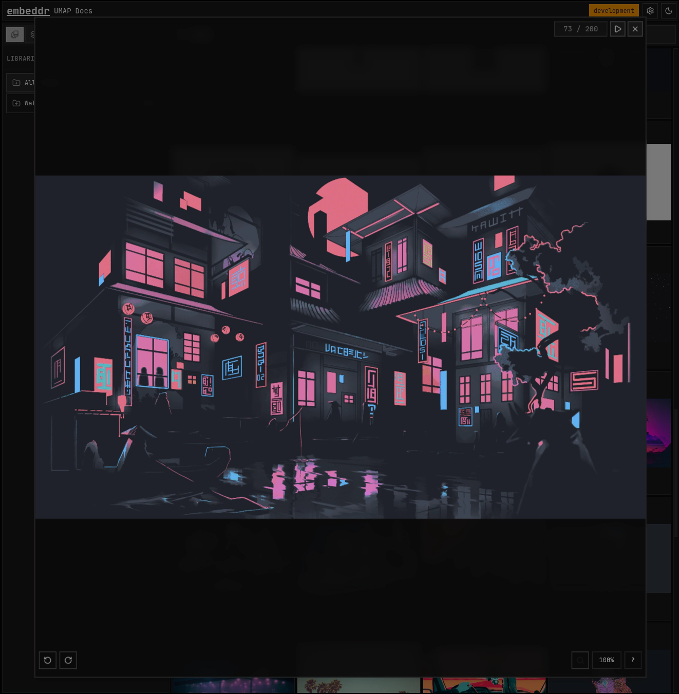
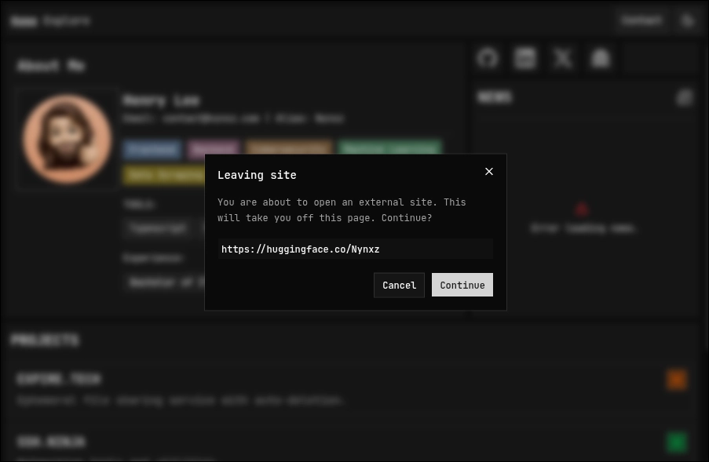
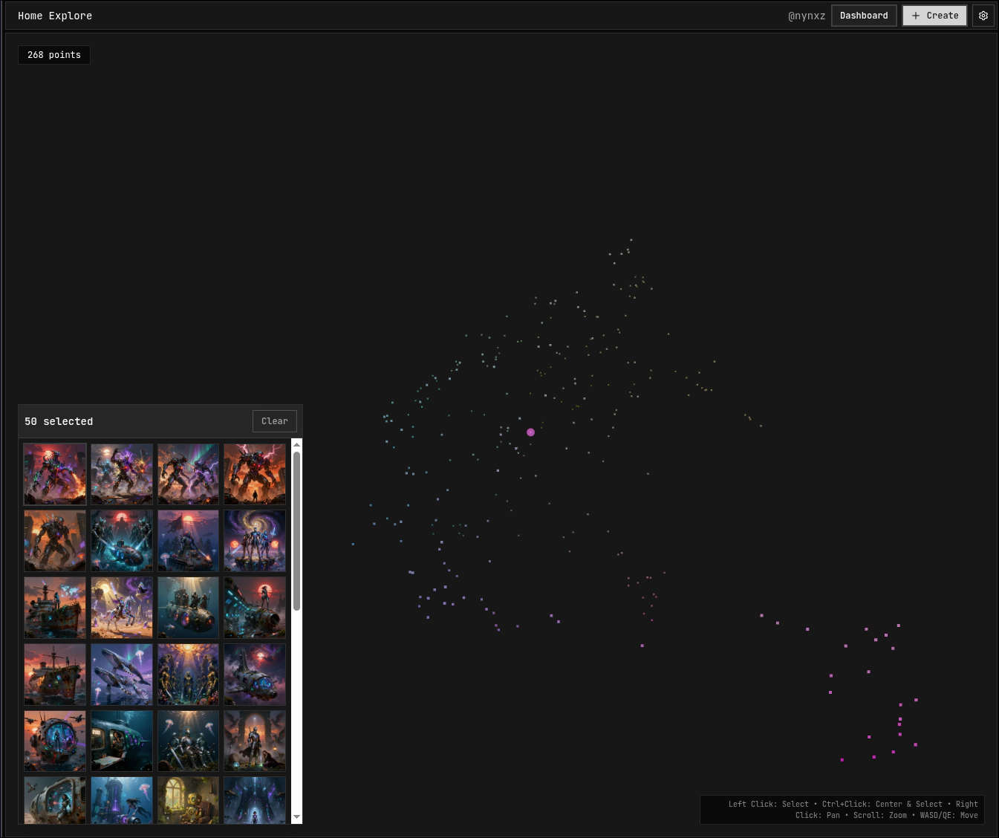

<div align="center"><a name="readme-top"></a>


<h1>Embeddr React Components</h1>
</div>

[![npm downloads][npm-downloads-image]][embeddr-react-ui-url]
[![embeddr-react-ui version][embeddr-react-ui-image]][embeddr-react-ui-url]

[![pypi version][pypi-image]][pypi-url]
[![embeddr-core version][embeddr-core-image]][embeddr-core-url]

[![embeddr-frontend][embeddr-frontend-image]][embeddr-frontend-url]

[![license][license-image]][license-url]

[npm-downloads-image]: https://img.shields.io/npm/d18m/%40embeddr%2Freact-ui?style=flat-square&&logo=Npm&logoColor=%23cc3534&label=Downloads&labelColor=%232f2f2f&color=%234f4f4f
[pypi-image]: https://img.shields.io/pypi/v/embeddr-cli?style=flat-square&&logo=Python&logoColor=%23ffd343&label=cli&labelColor=%232f2f2f&color=%234f4f4f
[pypi-url]: https://pypi.org/project/embeddr-cli
[embeddr-core-image]: https://img.shields.io/pypi/v/embeddr-core?style=flat-square&logo=Python&logoColor=%23ffd343&label=core&labelColor=%232f2f2f&color=%234f4f4f
[embeddr-core-url]: https://pypi.org/project/embeddr-core
[embeddr-react-ui-image]: https://img.shields.io/npm/v/%40embeddr%2Freact-ui?style=flat-square&logo=React&logoColor=%61DBFB&label=react-ui&labelColor=%232f2f2f&color=%234f4f4f
[embeddr-react-ui-url]: https://www.npmjs.com/package/@embeddr/react-ui
[embeddr-frontend-image]: https://img.shields.io/npm/v/%40embeddr%2Freact-ui?style=flat-square&logo=React&logoColor=%61DBFB&label=frontend&labelColor=%232f2f2f&color=%234f4f4f
[embeddr-frontend-url]: https://github.com/embeddr-net/embeddr-frontend
[license-image]: https://img.shields.io/github/license/embeddr-net/embeddr-cli?style=flat-square&logoColor=%232f2f2f&labelColor=%232f2f2f&color=%234f4f4f
[license-url]: https://pypi.org/project/embeddr-cli

> [!WARNING]
>
> You do not need this if you want to use Embeddr
>
> This repo is for development only.
>
> Please use [embeddr-cli](https://github.com/embeddr-net/embeddr-cli)

This package lives strictly in the UI layer and communicates with the backend
only through stable client contracts.

---

## Currently used by

- **Embeddr Zen UI / frontend distribution**  
  https://github.com/embeddr-net/embeddr-frontend

- **Embeddr ComfyUI embedded client**  
  https://github.com/embeddr-net/embeddr-comfyui

---

## Plugin developer docs

- https://docs.embeddr.net
- Plugin-focused docs and examples should live under the docs site as they are published.

---

## Components

This library includes:

### Public import paths

Use explicit subpath imports for clear boundaries:

- `@embeddr/react-ui/components/ui` for base UI primitives and composed controls
- `@embeddr/react-ui/components/embeddr` for Embeddr-specific media components
- `@embeddr/react-ui/components/visualization` for UMAP and visualization components
- `@embeddr/react-ui/hooks` for plugin and UI hooks
- `@embeddr/react-ui/hooks/plugin` for plugin-oriented hooks
- `@embeddr/react-ui/hooks/distro` for shell/distro-oriented hooks
- `@embeddr/react-ui/types` for shared API and domain types
- `@embeddr/react-ui/context` for provider context hooks
- `@embeddr/react-ui/lib/*` for utility modules (`utils`, `dnd`, `reactive`, `renderables`, `artifact-graph`, `mdx`)

### Quick import examples

```tsx
import { Button, Card, ScrollArea } from "@embeddr/react-ui/components/ui";
import {
  EmbeddrImage,
  VideoPlayer,
} from "@embeddr/react-ui/components/embeddr";
import { Umap3DExplorer } from "@embeddr/react-ui/components/visualization";
import { usePluginDrop, usePluginStorage } from "@embeddr/react-ui/hooks";
import { usePluginAPI } from "@embeddr/react-ui/hooks/plugin";
import { useImageDialog } from "@embeddr/react-ui/hooks/distro";
import type { EmbeddrAPI } from "@embeddr/react-ui/types";
import { EmbeddrDnDTypes } from "@embeddr/react-ui/lib/dnd";
```

> [!TIP]
> Use package export paths (`@embeddr/react-ui/...`) in consuming apps and plugins.

### Themed shadcn components

Embeddr uses a themed and extended version of
[shadcn/ui](https://ui.shadcn.com/) as a base.

These components integrate with:

- Embeddr theming tokens
- layout and panel containers
- distribution-specific styling

---

## Hooks

### Hook audiences

- **Plugin-focused hooks**: import from `@embeddr/react-ui/hooks/plugin`
  - `usePluginAPI`, `usePluginDrop`, `usePluginStorage`, `usePluginSetting`
  - `useWebSocketEvent`, `useWebSocketStream`
  - `useArtifact`, `useImage`, `useResolvedArtifact`
- **Distro/shell hooks**: import from `@embeddr/react-ui/hooks/distro`
  - `useImageDialog`, `useExternalNav`, `usePanelStack`, `useLocalStorage`
- **Backwards compatibility**: `@embeddr/react-ui/hooks` still re-exports both groups

### `usePluginAPI`

Canonical hook for plugin development. Returns the shell-provided API exposed
via `EmbeddrProvider` when a plugin is mounted.

---

### `useImageDialog`

Provides a lightbox and gallery viewer for artifacts and media.



---

### `useExternalNav`

Provides a confirmation and safety layer before navigating to
external sites from inside an Embeddr shell.



---

## Visualization components (in progress)

> [!NOTE]
> Visualization exports are available now, but APIs may continue to evolve during 0.2.x as usage expands.

### 3D UMAP explorer (available, evolving)



### 2D UMAP explorer (in development)

---

## Contributing

Package-specific contribution guidance lives in
[CONTRIBUTING.md](CONTRIBUTING.md).

For general contribution guidelines, see:

https://github.com/embeddr-net/embeddr-cli

---

## Related packages

- **embeddr frontend distributions**
  https://github.com/embeddr-net/embeddr-frontend

- **Embeddr CLI**
  https://github.com/embeddr-net/embeddr-cli

- **Embeddr core**
  https://pypi.org/project/embeddr-core

- **Embeddr docs**
  https://docs.embeddr.net

## License

Copyright 2026 Embeddr Labs and Contributors

Licensed under the Apache License, Version 2.0 (the "License");
you may not use this project except in compliance with the License.
You may obtain a copy of the License at:

http://www.apache.org/licenses/LICENSE-2.0
